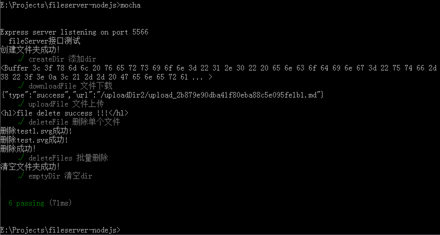
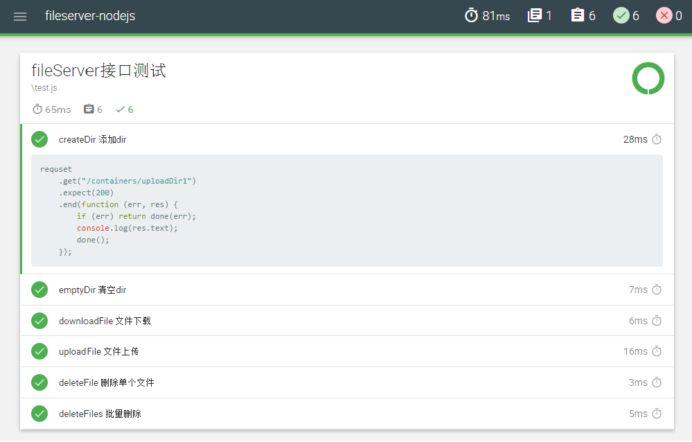
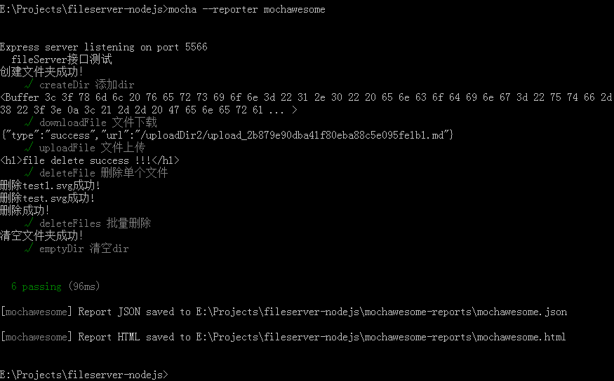

## 说明
test目录中test.js为测试用例文件. 要运行测试用例, 需要相应的工具, 本文使用的是mocha. 在node环境中安装mocha可直接在命令行工具中cd到项目根目录执行命令npm install mocha. 更多mocha使用帮助, 请参考[测试框架 Mocha 实例教程](http://www.ruanyifeng.com/blog/2015/12/a-mocha-tutorial-of-examples.html).

安装好mocha后, cd到项目根目录, 执行命令 mocha (mocha默认运行test子目录里面的测试脚本), 即可看到相应的测试结果, 如下所示:  

若想生成更直观的报表, 我们可以使用mochawesome插件. testResult.png为某一次测试生成的HTML格式报表截图, 如下所示:  

若想在本地生成测试报告, 需要安装mochawesome ( npm install mochawesome ), 然后cd 到项目根目录, 执行命令 mocha --reporter mochawesome, 执行完毕后会在项目根目录下生成mochawesome-reports文件夹, 测试结果也存放在此文件夹中, 如下所示:  

> 注意: 如果测试用例中上传或下载的接口报错, 请先确认相应文件夹中相关资源是否存在.

*有任何问题,欢迎随时RTX: wuxuebin*
